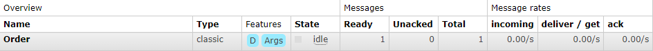
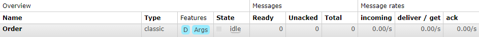

# Demo RabbitMQ
Demo program Message Broker menggunakan RabbitMQ.

Defaultnya server RabbitMQ berjalan pada port 1562. Untuk melakukan monitoring, buka RabbitMQ Management: http://localhost:15672, Untuk login masukan `guest` pada field username dan password.

## Order Service
~~~
POST http://localhost:3000/api/order
Content-Type: application/json

{
  "message": "Pesan yang akan dikirim"
}
~~~

### Keterangan :
Angka pada Kolom `Ready` dan `Total` menandakan jumlah data buffer yang tersimpan dan siap dikirimkan ke `Notifikasi Service`

## Notification Service
~~~
GET http://localhost:3000/api/notif
Content-Type: application/json
~~~
~~~
{
  "status": "success",
  "data": {
    "deliveryTag": 1,
    "consumerTag": "amq.ctag-bLGpTaaaobHZY13aiR-Hbw",
    "message": "Lorem ipsum dolor sit amet"
  }
}
~~~

### Keterangan :
Kolom `Ready` dan `Total` akan berkurang jika data yang tersimpan sebelumnya telah terkirim/diterima oleh consumer.